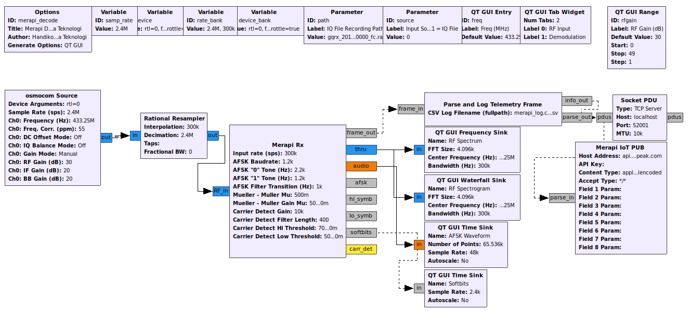
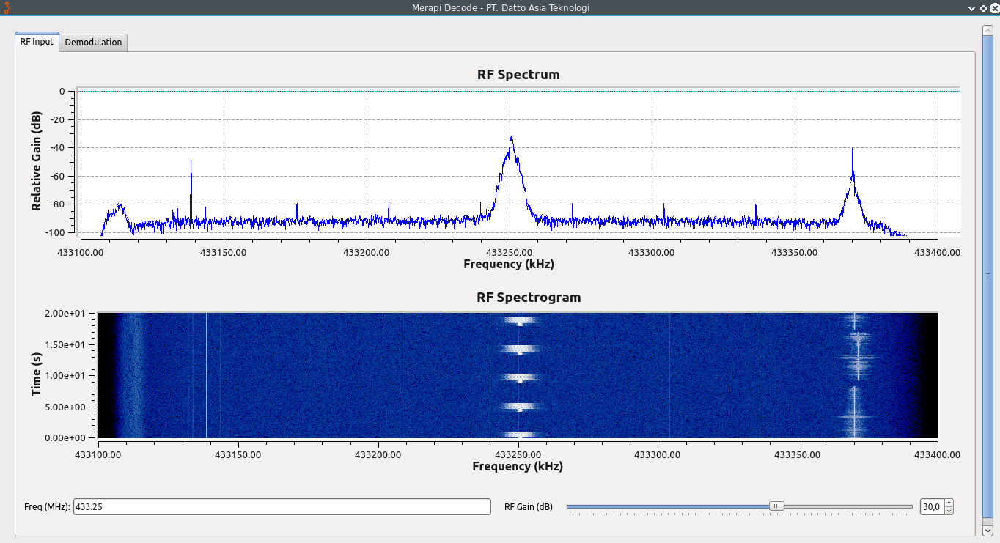
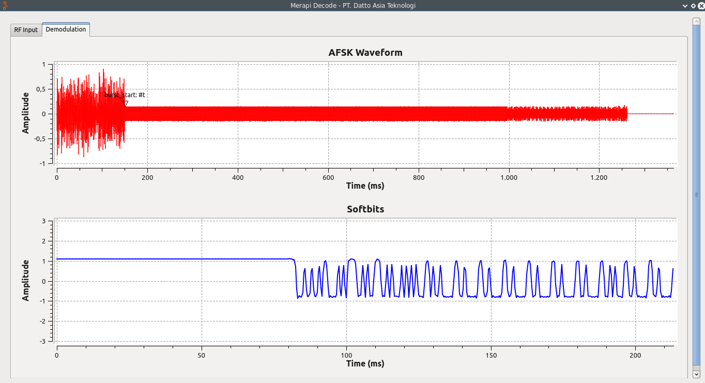
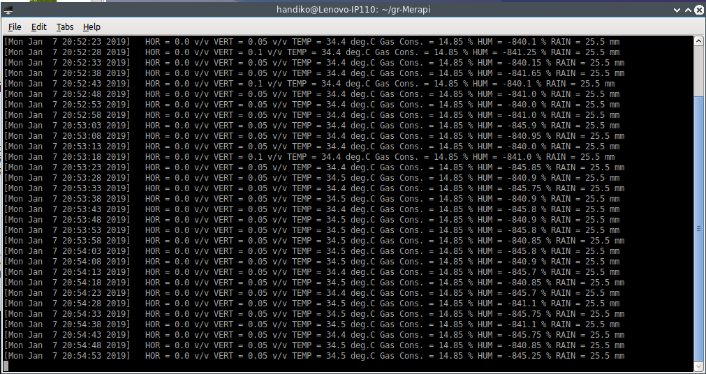
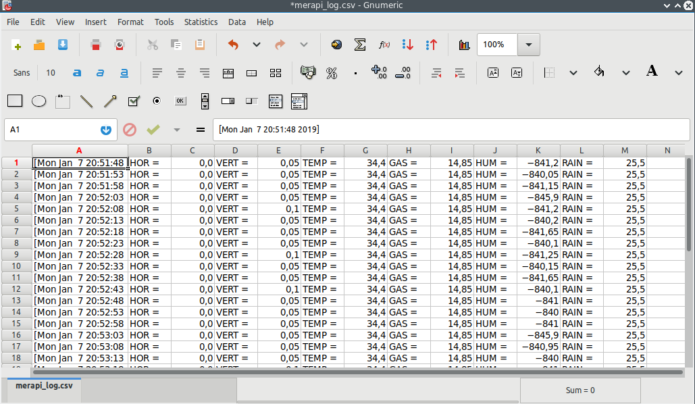

# gr Merapi - A GNU Radio Block for Telemetry
This project is about an SDR based decoder which run in GNU Radio platform to receive telemetry transmission from Balerante Station (Mt. Merapi). This transmission contains 6 data fields (horizontal & vertical vibration, temperature, humidity, rain measurement, and sulphuric compound gas. The data protocol was made by Mr. Angga and sponsored by PT. Datto Asia Technology and Sensor and Sistem Telecontrol Lab, Universitas Gadjah Mada.
Tested on GNU Radio 3.7.10 and Ubuntu 16.04

## Dependencies
There are a few dependencies required to compile this project. Which are:
* GNU Radio V.3.7.10 and Up
* Boost
* SWIG
* CMAKE
* GR-OSMOSDR
* RTL-SDR

Here are the steps required to install them:
* `sudo apt-get update && sudo apt-get upgrade -y`
* `sudo apt-get install libboost-all-dev swig cmake git gcc -y`
* `sudo apt-get install gnuradio gr-osmosdr rtl-sdr`

## Installation
This project is built using gr_modtool which bundle up all the script into an installable module. To install this module, open up the Terminal and run:
* `git clone https://github.com/handiko/gr-Merapi.git`
* `cd gr-Merapi`
* `mkdir build`
* `cd build`
* `cmake ../ -DCMAKE_INSTALL_PREFIX=/usr`
        OR
* `cmake ../ -DCMAKE_INSTALL_PREFIX=/usr/local`
        (depends on your system)
* `make`
* `sudo make install`
* `sudo ldconfig`

## Example
There is a .grc example included in **gr-Merapi/examples**. Open it up in GNU Radio companion by typing:
* `cd`
* `cd gr-Merapi/examples`
* `gnuradio-companion merapi_decode.grc`

The Flowgraph:

When it runs, it will receive the telemetry signal at 433,250 MHz from Mt. Merapi.

If the demodulation process success, the following waveform would appears periodically:

By telnet-ing to localhost 52001, you would see the received sensor values

The values are logged as a CSV file in your home folder

## Acknowledgement
* PT. Datto Asia Teknologi
* Lab. Sensor dan Sistem Telekontrol, Universitas Gadjah Mada
* ORARI Daerah DIY

## Contributing
1. Fork it [https://github.com/handiko/gr-Merapi/fork](https://github.com/handiko/gr-Merapi/fork)
2. Create new branch (`git checkout -b add-blah-blah`)
3. Do some editing / create new feature
4. Commit your works (`git commit -m "Adding some blah blah blah.."`)
5. Push to the branch (`git push -u origin add-blah-blah`)
6. Create a new Pull Request
